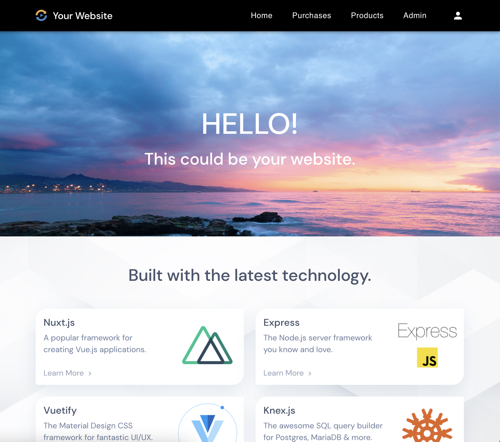

# Nuxt SSR Secure Website


<br><br>

## Overview

This project is a basic, secure, production-ready website. It has:
- A Landing page with modern UI and sample sections
- Nav with mobile-friendly menus 
- Email registration and login
- Admin page with create, read, update & delete operations 
- Security best practices throughout.

The code is clear and fully commented so you can easily customize it for your own purposes.  

You can also use the project as a base for your own code demo that requires Nuxt, Node.js and/or Express.  

## Technology

- [**Nuxt.js**](https://nuxtjs.org/) - A framework for creating Vue.js applications.  
- [**Express**](https://expressjs.com/) - The Node.js server framework you know and love.  
- [**Vuetify**](https://vuetifyjs.com/en/) - The Material Design CSS framework for fantastic UI/UX.  
- [**Knex.js**](http://knexjs.org/) - SQL query builder for Postgres, MariaDB & more.  
- [**Joi Validation**](https://joi.dev/api/?v=17.4.0) - A Data validation library for Javascript.  
- [**Node ES Modules**](https://blog.logrocket.com/es-modules-in-node-today/) - Share code between the Vue client and the Express server.  

## Security Features

- **Helmet.js** - Adds security-related HTTP response headers to prevent attacks like ClickJacking, sniffing attacks and more.  
- **Content Security Policy (CSP)** - An added layer of security that helps to detect and mitigate certain types of attacks, including Cross Site Scripting (XSS) and data injection.  
- **Sanitized & Validated input** - All input on both the client and server is sanitized & validated using the powerful Joi validation and sanitize-html libraries.  
- **Login Captcha** - SVG Captcha prevents bots from spamming your login page. The captcha randomly shows text or a math problem to keep bots guessing.  
- **User Access List** - Controls access to all pages and routes based on user type. You can change access rules for any page or server route from a single file.  
- **Secure JSON WebTokens** - Uses JWT to verify login. The accessToken stored in memory (Vuex) and the refreshToken is HttpOnly with 'expires' and 'sameSite' flags.  


## Requirements
- Node > v14.15.1
- Local database (Postgres, MSSQL, MySQL, MariaDB, Oracle, or Amazon Redshift)

## Project Setup

**Clone Project and Install Dependencies**

`git clone https://github.com/adamlove01/nuxt-ssr-secure-website.git`  
`cd nuxt-ssr-secure-website`  
`npm install`

## Development Environment
This project was built using Vscode with [Vetur](https://flaviocopes.com/vue-vscode/#linting-and-error-checking), [Eslint](https://www.npmjs.com/package/eslint) and [Prettier](https://www.npmjs.com/package/prettier). If you wish to use a similar setup, you can follow this guide:

[Vscode Setup - Vetur, Eslint, Prettier](docs/vscode.md)


## Set up a local database

You will need a database that is supported by Knex.JS:
Postgres, MSSQL, MySQL, MariaDB, Oracle, or Amazon Redshift.

**Install a database server on your local machine**

Example for postgres on MacOS using brew:  
`brew install postgres`  
`brew services start postgresql`  

**Create a database, user and grant user privileges**

`psql postgres`  
`create database myDatabase;`  
`create user myUser with encrypted password 'myPassword';`  
`grant all privileges on database myDatabase to myUser;`  
Exit psql  
`\q`  

## Install a Node.js database driver in your project

For postgres, 'pg' is already installed. If you are using another database, for example MariaDB or MySQL, use can uninstall 'pg' and install 'mysql' connector instead:  
`cd nuxt-ssr-secure-website`  
`npm install mysql`  

## Create an .env file

The `.env` file defines your environment variables for the project.  
`cd nuxt-ssr-secure-website`  
`touch .env`  

Add your database connection information that you created above. The default DB_PORT will depend on which database you use. DB_CLIENT is the database connector from above.

The TOKEN_AUTH_SECRET should be a secure password. You can go to [SHA-256 hash calculator](https://xorbin.com/tools/sha256-hash-calculator) and quickly generate a SHA-256 hash.

Example using postgres:

```
NODE_ENV=development
BASE_URL=http://localhost:3000
BROWSER_BASE_URL=http://localhost:3000
TOKEN_AUTH_SECRET=6f3dd6e7005ff901ec4330479363218e61e94fae4a86f072e44db4636b8dd7b2
DB_PORT=5432
DB_NAME=myDatabase
DB_HOST=localhost
DB_USER=myUser
DB_PASSWORD=myPassword
DB_CLIENT='pg'
DB_CHARSET='utf8'
...
```

## Run database migrations and seeds

**Migrations**  
The migration files are in the `/database/migrations` folder. They create tables in your existing database.  

`cd nuxt-ssr-secure-website`  
`knex migrate:latest --knexfile knexfile.cjs`  

**Seeds**  
The seed files are in the `/databse/seeds` folder. They add data to your tables.

`cd nuxt-ssr-secure-website`  
`knex seed:run --knexfile knexfile.cjs`  

## Start up the local server with hot reload

`cd nuxt-ssr-secure-website`  
`npm run dev`  

When you see  
```
✓ Client  
✓ Server  
```
go to `localhost:3000` in your browser to see the project running.

## Sending emails from your server

If you try to register a new user at this point, the verification email will not be sent. To send email from your server you will need to configure Nodemailer and an email delivery provider. You can follow this guide:

[Configuring Nodemailer for sending email](docs/emailConfig.md)

## Run the project on your production server

**Set up a database**  

First set up a database on the server and start it up. 

**Upload the project to your server**  

You can use Git or some other method. A good place for your project is `/var/www`.

**Create an .env file**  

`cd [project root]`  
`touch .env`  

Create a new `.env` file at the root of your server project. You will use all the same variables as on your local system `.env` file, but you need to change the database DB_ values to match your server database.  
 
`.env`
```
NODE_ENV=production
BASE_URL=http://localhost:3000
BROWSER_BASE_URL=https://myDomain.org
TOKEN_AUTH_SECRET=6f3dd6e7005ff901ec4330479363218e61e94fae4a86f072e44db4636b8dd7b2
DB_PORT=5432
DB_NAME=myDatabase
DB_HOST=localhost
DB_USER=myUser
DB_PASSWORD=myPassword
DB_CLIENT='pg'
DB_CHARSET='utf8'
...
```
BROWSER_BASE_URL is for Axios calls (configured in nuxt.config.js) and should match your domain url.  

BASE_URL should be http://localhost:3000 if you are running your site behind NGINX, otherwise it should also match your domain url.  

**Run migrations and seeds**  

`cd [project root]`  
`knex migrate:latest --knexfile knexfile.cjs`   
`knex seed:run --knexfile knexfile.cjs`  

**Build the project**  

`cd [project root]`  
`npm install`  
`npm run build`  
`npm run start`  

Note that `npm run start` will run the app in your terminal, but when you close the terminal or press 'ctrl-c', the app will stop. When you set up systemd as below, you can run `systemctl start mydomain` instead, and your app will always be running in the background.

## Set up systemd to autostart the project on your server

You will want your app to restart automatically if your server is restarted. On most Linux systems, you can configure systemd to auto-start your app. To do that, you can follow this guide:

[Set up systemd to autostart](docs/systemd.md)

## knexfile.cjs

This file contains your database configuration. All the values are imported from your `.env` file.

## nuxt.config.js

This file contains the configuration for the NuxtJS framework.  

## JSON WebTokens

The login system in this app uses JSON WebTokens to verify login. 

**The AccessToken**

This token is stored in-memory in Vuex and expires in 15 minutes. We are using Vuex for this data because other solutions such as client-side Cookies or localStorage are considered a security risk -- they are javascript-accessible and can be hacked.

**The refreshToken**

Login status (as verified by the 'authorize' middleware) is persisted (after page refresh, opening a new tab, or accessToken expiry) by an HTTPOnly 'refreshToken' cookie, which is set server-side. This cookie has a 7-day expiry and is not accessible via javascript.

If the user has disabled cookies in their browser, they can still remain logged in for 15 minutes (the expiry of the accessToken in the Vuex store) as long as they do not refresh the page or open a new tab. This is a good trade-off, since very few users will have cookies disabled. The accessToken has only 15 minute expiry to make it very difficult for hackers.

## More Features Coming Soon
- Login: Add forgot password / Reset password logic
- Footer Section with 'Privacy' and 'Terms of Service' pages
- More Section components
- Winston and Morgan logging
- Server-side pagination and filtering
- Contact Us page
- Newsletter signup widget
- Youtube videos for the project: Code walkthrough
- Docs: NGINX configuration  
- Docs: Explanation of variables in nuxt.config.js

## Author

[Adam Love](https://github.com/adamlove01)  

## License

This project is licensed under the [GPLv3 License](https://www.gnu.org/licenses/gpl-3.0.en.html)


